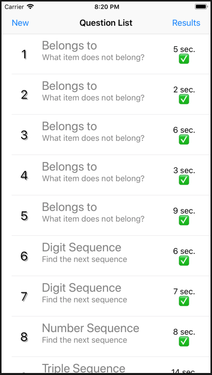
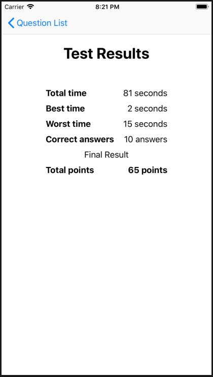
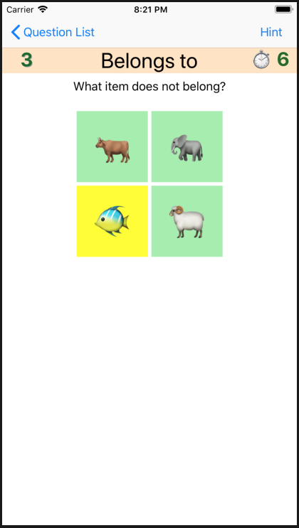
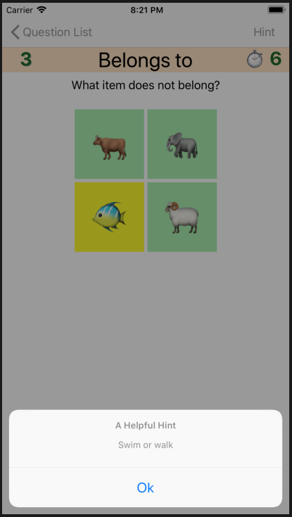

# ios-cognitive-test

Cognitive test application for iOS

## Features

* Display a list of questions over different topics (association, sequences, mathematical, logical)
* Choose the right answer until finished the challenge
* Optionally, you can get a *Hint* about the current question
* Get a final report about your performance

## Screenshots

## Components used

* Use of `UISplitViewController` to manage Navigation and a Split view between Questions and content
* Use of `UITableView` for the main Question list
* Using a custom `UIView` (`CogView`) to display question content
* Using `UINavigationItem` to display navigation buttons (New, Results, Hint)
* Using `UIAlertController` to display messages, confirmations and hints
* Using `UINavigationController` to control custom navigation between views.

